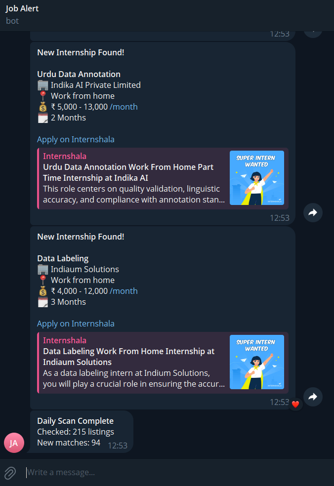

# Job Alert Bot

Automatically scrapes Internshala daily and sends new internship alerts to Telegram.

## Problem it solves
Manually checking job boards every day wastes time and causes you to miss
early postings. This bot runs every morning at 9 AM, filters by your keywords
and location, and sends only new listings directly to your phone.

## How it works
1. Scrapes Internshala for each keyword in config.json
2. Filters by location preference
3. Deduplicates — never alerts the same job twice
4. Sends formatted Telegram messages with apply link
5. Sends a daily summary of how many listings were checked

## Setup
1. Clone the repo
2. `pip install requests beautifulsoup4 python-telegram-bot schedule`
3. Fill in `config.json` with your bot token and chat ID
4. Run `python scraper.py`

## Tech stack
Python, BeautifulSoup, Requests, Telegram Bot API, Schedule

## Screenshot
